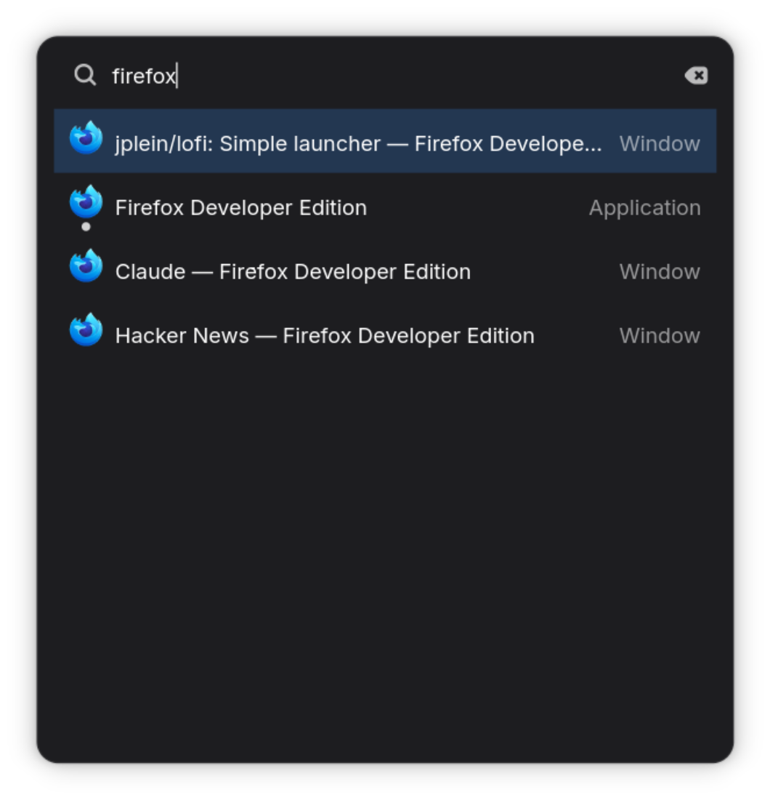

# LoFi

LoFi is a small launcher for GNOME and macOS.




## Goals

- Fast: LoFi should launch and display its results instantly
- Predictable: Typing the same input should find the same target, each time

## Feature set

LoFi is limited in what it can do. It can't search for or within files, it can't connect to web applications: these operations can take a long time, so it doesn't try to do them.

What it can do:

- Launch applications
- Window management and navigation:
    - Switch focus to an open window (GNOME only)
    - Switch to another workspace (GNOME only)
    - Operations on the active window:
        - Resize
        - Toggle maximize
        - Toggle full-screen
- Power management
- Logout
- Locking the screen

## System requirements: Linux

- NixOS
- GNOME

## Install: Linux

LoFi ships a Nix flake with a home-manager module that installs the launcher
binary, symlinks the GNOME Shell extension into your profile, and enables the
extension via dconf.

1. **Add the LoFi input to your flake** (`flake.nix`):

   ```nix
   inputs = {
     # ...
     lofi = {
       url = "github:jplein/lofi";
       inputs.nixpkgs.follows = "nixpkgs";
     };
   };
   ```

   Pass your flake `inputs` through to home-manager so the module can reach
   the `lofi` input:

   ```nix
   home-manager.extraSpecialArgs = { inherit inputs; };
   ```

2. **Add the home-manager module** to your home-manager config (e.g.
   `home.nix`) and enable it:

   ```nix
   { inputs, ... }:
   {
     imports = [ inputs.lofi.homeManagerModules.lofi ];

     programs.lofi.enable = true;
   }
   ```

   Then rebuild, e.g. `sudo nixos-rebuild switch --flake .#<host>`.

   If you already manage `org/gnome/shell` `enabled-extensions` elsewhere in
   your config, the two lists will conflict on the same dconf key — wrap the
   combined list in `lib.mkForce` and include `"lofi-shell@jplein.dev"`:

   ```nix
   dconf.settings."org/gnome/shell" = {
     enabled-extensions = lib.mkForce [
       # ...your other extensions...
       "lofi-shell@jplein.dev"
     ];
   };
   ```

   Alternatively, set `programs.lofi.enableShellExtension = false` and add the
   UUID to your own `enabled-extensions` list.

3. **Log out and log back in.** The GNOME Shell extension only loads on session
   start (a Wayland constraint), so it stays inactive until you start a fresh
   session.

Bind a shortcut to the `lofi` command to summon the launcher — there is no
default. With home-manager you can add a GNOME custom keybinding via dconf, for
example mapping `<Alt>space` to `lofi`:

```nix
dconf.settings = {
  # Register the custom keybinding slot...
  "org/gnome/settings-daemon/plugins/media-keys" = {
    custom-keybindings = [
      "/org/gnome/settings-daemon/plugins/media-keys/custom-keybindings/custom0/"
    ];
  };

  # ...then define it.
  "org/gnome/settings-daemon/plugins/media-keys/custom-keybindings/custom0" = {
    binding = "<Alt>space";
    command = "lofi";
    name = "LoFi";
  };
};
```

## System requirements: macOS

- macOS Tahoe (15+)
- Xcode 26 (for the Swift toolchain)
- Nix + direnv (provides Bazel and the Rust toolchain via the flake)

## Install: macOS

```sh
bazelisk run //app/macos:install
open ~/Applications/LoFi.app
```
