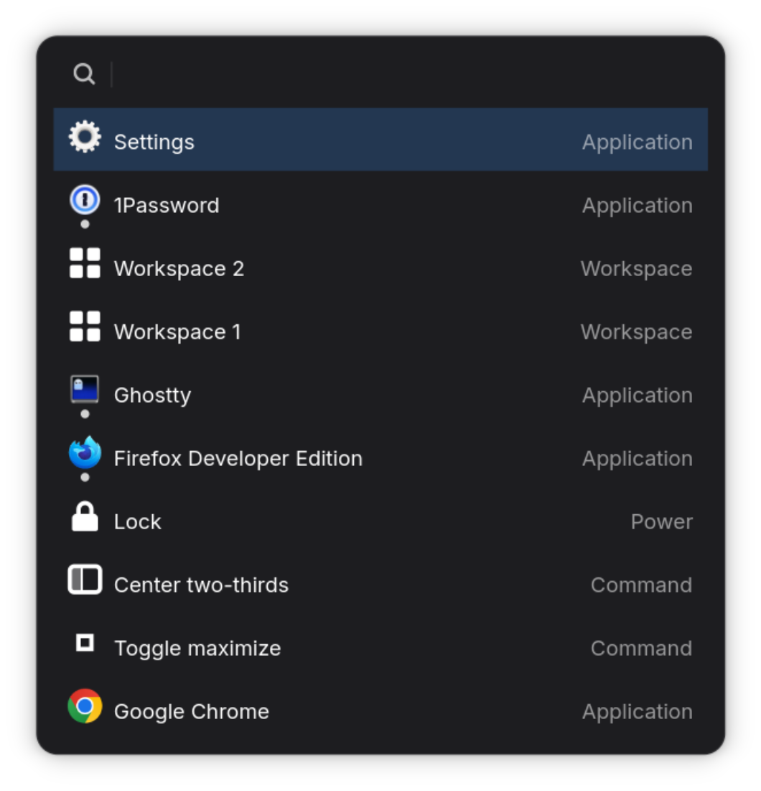

# LoFi

LoFi is a small launcher for GNOME and macOS (planned).

<!-- screenshot.png is a 2x (HiDPI) capture, 1060x1100; width="530" renders it
     at its intended 1x size while still serving the full-resolution pixels so
     it stays sharp on Retina displays. -->

## Goals

- Fast: LoFi should launch and display its results instantly
- Predictable: Typing the same input should find the same target, each time

## Feature set

LoFi is limited in what it can do. It can't search for or within files, it can't connect to web applications: these operations can take a long time, so it doesn't try to do them.

What it can do:

- Launch applications
- Window management and navigation:
    - Switch focus to an open window
    - Switch to another workspace
    - Operations on the active window:
        - Resize
        - Move to another workspace
        - Close
- Anything that can be defined as a command:
    - Power management
    - Locking the screen

## System requirements: Linux

- NixOS
- GNOME

## System requirements: macOS

(Experimental)

- macOS Tahoe (15+)
- Xcode 26 (for the Swift toolchain)
- Nix + direnv (provides Bazel and the Rust toolchain via the flake)

The macOS frontend at `app/macos/` is built by Bazel — `rules_rust` produces `liblofi_core.a`, `rules_swift` + `rules_apple` produce `LoFi.app`. `bazel run //app/macos:launch` floats an `NSPanel` listing every `.app` bundle under `/System/Applications`, `/Applications`, and `~/Applications`, with a fuzzy-filtering search field. It does not yet support MRU, launching, or a global hotkey — see `app/macos/README.md` for the slice-by-slice rollout plan.
