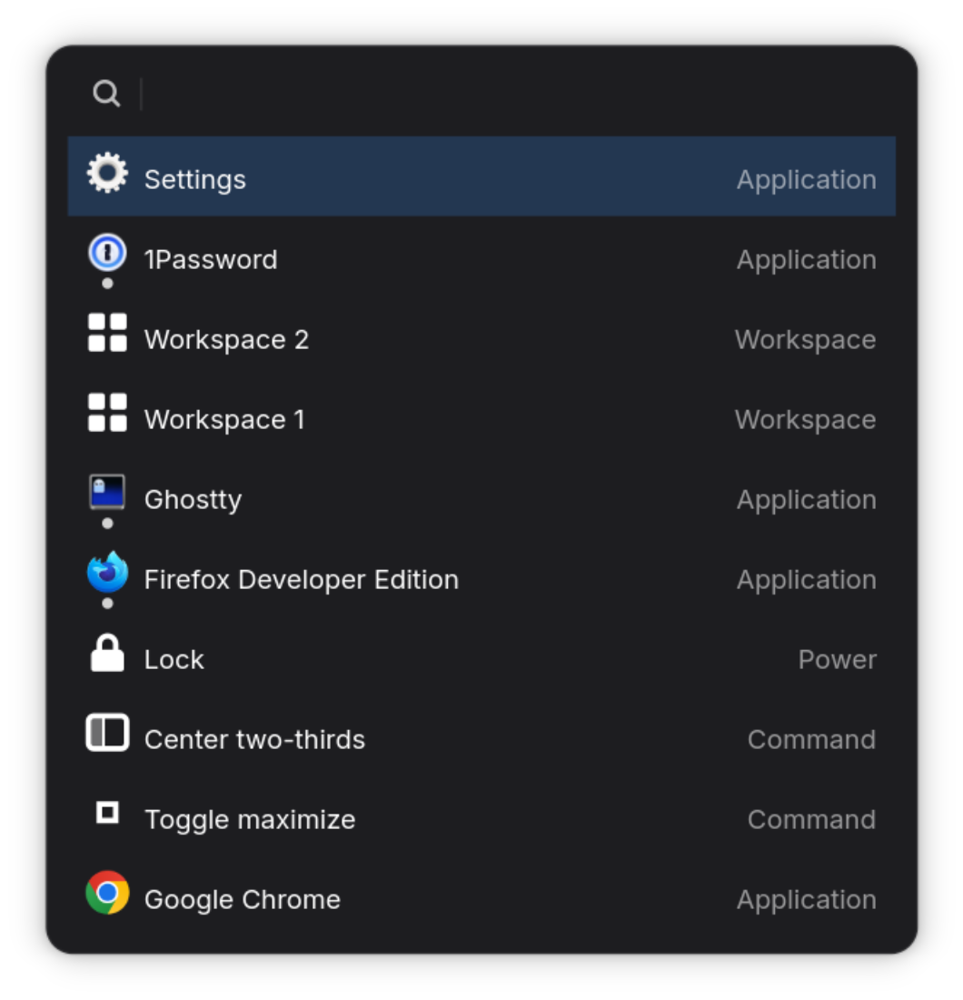
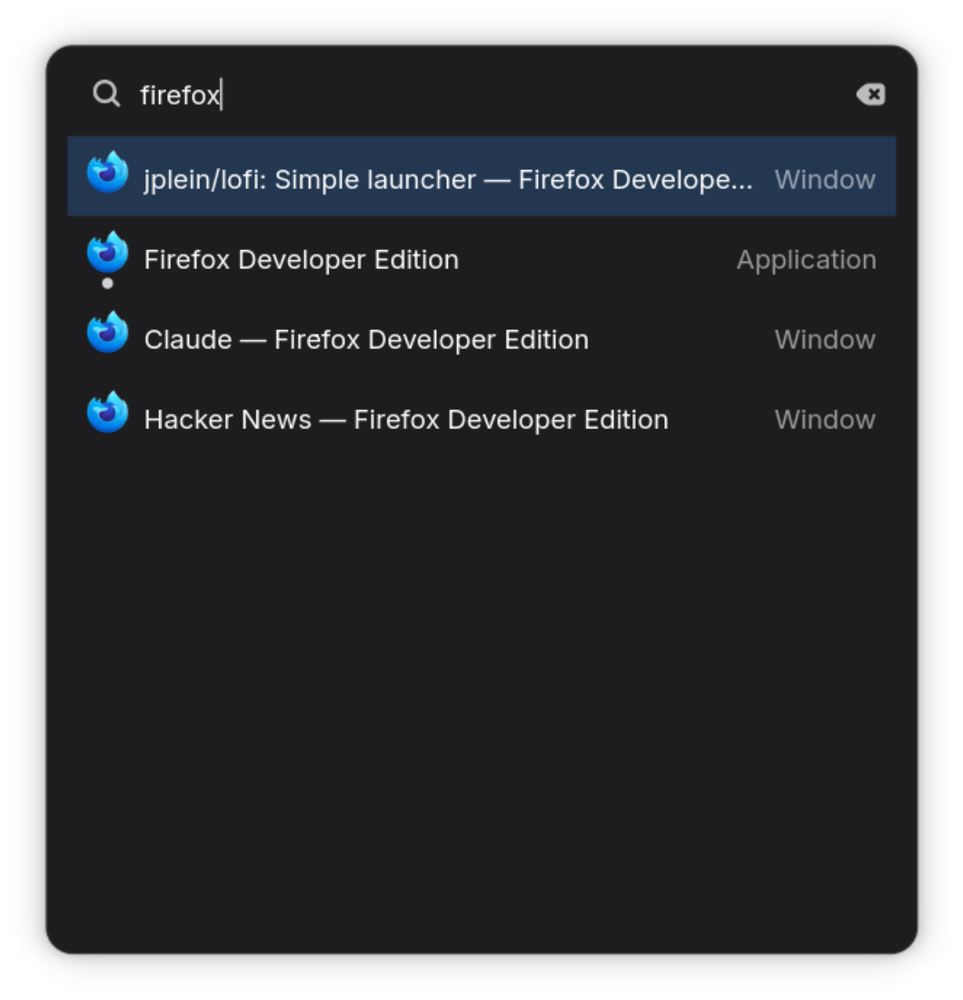

# LoFi

LoFi is a small launcher for GNOME, Niri, and macOS.





## Goals

- Fast: LoFi should launch and display its results instantly
- Predictable: Typing the same input should find the same target, each time

## Feature set

LoFi is limited in what it can do. It can't search for or within files, it can't connect to web applications: these operations can take a long time, so it doesn't try to do them.

What it can do:

- Launch applications
- Window management and navigation:
    - Switch focus to an open window (Linux only)
    - Switch to another workspace (Linux only)
    - Move a window to another workspace (Linux only)
    - Operations on the most recently focused window:
        - Resize / retile
        - Toggle maximize
        - Toggle full-screen
- Power management
- Logout
- Locking the screen

The window-action rows differ by desktop, because a window action means
different things on a floating desktop and on a scrolling tiler. GNOME and
macOS get position-and-size commands (`Left half`, `Center third`, `Minimize`,
…); Niri gets column-width presets and layout toggles (`Width half`,
`Maximize column`, `Expand column`, `Toggle floating`, `Close window`, …).
`Toggle maximize` and `Toggle fullscreen` exist everywhere. See
[app/linux/README.md](app/linux/README.md#window-commands-under-niri).

## System requirements: Linux

- NixOS
- GNOME or [Niri](https://github.com/YaLTeR/niri)

One `lofi` binary serves both. It picks its backend at run time from
`$NIRI_SOCKET` / `$XDG_CURRENT_DESKTOP`, so there is nothing to configure and
nothing to rebuild when you switch sessions.

The two differ in what they need *installed*, and only GNOME needs anything:

- **GNOME** requires the LoFi Shell extension. Wayland clients can't enumerate
  or manipulate other apps' windows, and Mutter exposes no adequate substitute,
  so the extension is how the launcher sees windows and workspaces at all.
- **Niri** requires nothing installed. The compositor's own IPC socket is the
  whole interface, and the launcher presents itself as a layer-shell overlay.

Niri users may want [a config file](#configuration) all the same. A layer
surface gets no decorations from either side, so the launcher comes up as a
plain rounded rectangle until you tell it what your border and shadow look
like.

## Install: Linux

LoFi ships a Nix flake with a home-manager module that installs the launcher
binary and — on GNOME — symlinks the Shell extension into your profile and
enables it via dconf.

1. **Add the LoFi input to your flake** (`flake.nix`):

   ```nix
   inputs = {
     # ...
     lofi = {
       url = "github:jplein/lofi";
       inputs.nixpkgs.follows = "nixpkgs";
     };
   };
   ```

   Pass your flake `inputs` through to home-manager so the module can reach
   the `lofi` input:

   ```nix
   home-manager.extraSpecialArgs = { inherit inputs; };
   ```

2. **Add the home-manager module** to your home-manager config (e.g.
   `home.nix`) and enable it:

   ```nix
   { inputs, ... }:
   {
     imports = [ inputs.lofi.homeManagerModules.lofi ];

     programs.lofi.enable = true;
   }
   ```

   Then rebuild, e.g. `sudo nixos-rebuild switch --flake .#<host>`.

   If you already manage `org/gnome/shell` `enabled-extensions` elsewhere in
   your config, the two lists will conflict on the same dconf key — wrap the
   combined list in `lib.mkForce` and include `"lofi-shell@jplein.dev"`:

   ```nix
   dconf.settings."org/gnome/shell" = {
     enabled-extensions = lib.mkForce [
       # ...your other extensions...
       "lofi-shell@jplein.dev"
     ];
   };
   ```

   Alternatively, set `programs.lofi.enableShellExtension = false` and add the
   UUID to your own `enabled-extensions` list.

   **On Niri**, set `programs.lofi.enableShellExtension = false` — the GNOME
   extension does nothing there, and skipping it avoids writing the
   `org/gnome/shell` dconf key on a machine with no GNOME.

3. **On GNOME, log out and log back in.** The Shell extension only loads on
   session start (a Wayland constraint), so it stays inactive until you start a
   fresh session. Niri needs no restart.

### Binding a key

Bind a shortcut to the `lofi` command to summon the launcher — there is no
default. Running `lofi` a second time while it is open closes it, so a single
binding toggles it.

On **Niri**, add a bind to your `config.kdl`:

```kdl
binds {
    Mod+Space { spawn "lofi"; }
}
```

On **GNOME**, home-manager can add a custom keybinding via dconf — for example
mapping `<Alt>space` to `lofi`:

```nix
dconf.settings = {
  # Register the custom keybinding slot...
  "org/gnome/settings-daemon/plugins/media-keys" = {
    custom-keybindings = [
      "/org/gnome/settings-daemon/plugins/media-keys/custom-keybindings/custom0/"
    ];
  };

  # ...then define it.
  "org/gnome/settings-daemon/plugins/media-keys/custom-keybindings/custom0" = {
    binding = "<Alt>space";
    command = "lofi";
    name = "LoFi";
  };
};
```

## Configuration

LoFi reads `~/.config/lofi/config.toml` (or `$XDG_CONFIG_HOME/lofi/config.toml`).
The file is optional and so is every key in it.

```toml
lock-command = "swaylock -f -c 000000"

[appearance]
corner-radius = 12          # default 12
border-width  = 3           # default 0 — no border
border-color  = "#e0e0e0"   # default @borders

[appearance.shadow]         # omit for no LoFi-drawn shadow
softness = 30               # default 30
spread   = 8                # default 5
offset   = { x = 5, y = 5 } # default x=0 y=5
color    = "#00000080"      # default #0007
```

`[appearance]` is **Niri-only**. On GNOME the launcher is an ordinary window
and GTK already gives it the system's shadow and rounded corners; on Niri it is
a layer-shell overlay, which gets neither, and which the compositor can only
partly decorate. Colours take a hex value (`#0007`, `#e0e0e0`, `#00000080`), a
GTK named colour (`@borders`, `@accent_color`), or a CSS keyword (`black`).

### Matching your Niri theme

Niri can draw the launcher's shadow itself, and it cannot draw the other two
things at all — `border` and `clip-to-geometry` are window-rule properties that
a `layer-rule` rejects. So there are two arrangements, and you pick one by
whether you write an `[appearance.shadow]` block.

**LoFi draws everything.** One file, and the shadow keys are Niri's own names
with Niri's own meanings, so copy the numbers straight out of `config.kdl`:

```toml
[appearance]
corner-radius = 12
border-width  = 3
border-color  = "#e0e0e0"

[appearance.shadow]
softness = 30
spread   = 5
offset   = { x = 0, y = 5 }
color    = "#0007"
```

**Niri draws the shadow.** Leave the shadow block out and add a layer rule:

```toml
[appearance]
corner-radius = 12
border-width  = 3
border-color  = "#e0e0e0"
```

```kdl
layer-rule {
    match namespace="^lofi$"
    geometry-corner-radius 12
    shadow { on; }
}
```

Don't do both. To draw its own shadow LoFi pads its surface with transparent
room for the blur, and Niri draws a layer surface's shadow around the *whole*
buffer — it has no way to learn the visual bounds — so you would get Niri's
shadow floating a blur-width out from the window. With no shadow block LoFi
adds no padding, and the surface is exactly the visible rectangle that Niri's
shadow wants. Either way LoFi rounds its own corners, so `corner-radius` and
the layer rule's `geometry-corner-radius` should agree.

### Setting it from home-manager

`programs.lofi` can generate the file instead:

```nix
programs.lofi = {
  enable = true;
  lockCommand = "swaylock -f -c 000000";
  appearance = {
    cornerRadius = 12;
    borderWidth  = 3;
    borderColor  = "#e0e0e0";
    shadow = {
      enable = true;
      softness = 30;
      spread = 5;
      offsetY = 5;
      color = "#0007";
    };
  };
};
```

The file is written **only if you set at least one of those**. Set none and
nothing is generated, leaving `~/.config/lofi/config.toml` yours to hand-write
— it has to be one or the other, since a generated file is a read-only symlink
into the Nix store.

### Locking the screen on Niri

Niri implements the session-lock protocol but ships no locker, so the "Lock"
entry runs one. LoFi tries, in order: `$LOFI_LOCK_COMMAND`, then
`lock-command` from the config file, then the first of `swaylock`, `hyprlock`,
`waylock`, `gtklock` it finds on `$PATH`.

If you have none of those installed, LoFi falls back to asking logind to lock
the session — which only emits a signal, and so locks **nothing** unless you
also run an idle daemon (`swayidle`, `hypridle`) listening for it. If you want a
specific locker or specific arguments, set it explicitly:

```toml
lock-command = "swaylock -f -c 000000"
```

or, from home-manager:

```nix
programs.lofi.lockCommand = "swaylock -f -c 000000";
```

Either way the setting takes effect on the next `lofi` invocation — LoFi reads
the file itself, at activation.

> **If you set `programs.lofi.lockCommand` before:** it used to export
> `LOFI_LOCK_COMMAND` into your session environment, and it now writes the
> config file instead. The variable still wins when set, so the copy already
> exported into your **running** session keeps shadowing the new value until
> your next login. To check whether that is what you are seeing:
>
> ```sh
> tr '\0' '\n' < /proc/$(pgrep -x niri)/environ | grep LOFI
> ```

## System requirements: macOS

- macOS Tahoe (15+)
- Xcode 26 (for the Swift toolchain)
- Nix + direnv (provides Bazel and the Rust toolchain via the flake)

## Install: macOS

```sh
bazelisk run //app/macos:install
open ~/Applications/LoFi.app
```
